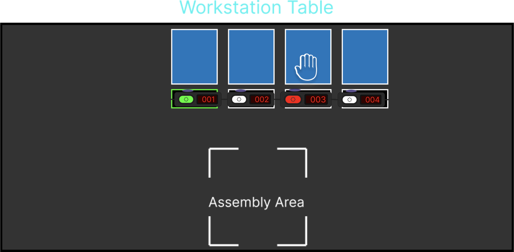

# Industrial Pick-to-Light Control System

An advanced Pick-to-Light (PTL) system implementation using IEC 61131-3 structured text programming with MQTT integration for industrial automation applications.




## 🚀 Features

- Real-time control of 4 PTL stations with color-coded feedback
- MQTT-based communication for distributed system integration
- Automated error detection and recovery system
- Color-coded visual feedback system:
  - Green: Active pick location
  - Red: Error indication (wrong pick)
- Timer-based state management
- Comprehensive debug monitoring
- Industrial I/O interface integration

## 📋 System Requirements

### Software Requirements
- CODESYS Development System V3.5 or later
- [CODESYS MQTT Library](https://github.com/stefandreyer/CODESYS-MQTT) 
- Network connectivity for MQTT communication

### Hardware Requirements
- PLC/Controller compatible with CODESYS Runtime (**TBEN-S2-2COM-4DXP** Controller from **Turck**)
- 4 PTL110S-FF100TD3-QPS150 devices from Bannerengineering.

- PLC supporting IEC 61131-3 Structured Text
- MQTT Broker (tested with broker running at port 1883)
- Digital I/O capabilities for PTL hardware interface
- Network connectivity for MQTT communication

## 🔧 Development Environment Setup

1. Install CODESYS Development System
2. Install MQTT Library:
   - Download the library from [CODESYS-MQTT Repository](https://github.com/stefandreyer/CODESYS-MQTT)
   - In CODESYS, go to Tools → Library Repository
   - Install the downloaded library
   - Add library reference to your project

## 🏗️ Project Structure

```
├── src/
│   ├── PLC_PRG.st          # Main program file
│   ├── FirstPublish.st     # MQTT publishing function block
│   └── FirstSubscription.st # MQTT subscription function block
├── docs/
│   └── hardware_setup.md   # Hardware configuration guide
└── README.md
```

## 🌐 MQTT Communication

### Topics
- Publish: `Test/PTL_touch` - Reports touch events
- Subscribe: `Test/PTL_1` - Receives control commands

### Message Format
- Simple integer-based protocol
- Values 1-4 correspond to PTL stations

## 💻 Implementation Details

### Color Codes
- 0: Off
- 1: Red (Error)
- 2: Green (Active)

### State Management
- Real-time touch detection
- Automatic error state recovery (1-second timeout)
- Persistent state tracking
- MQTT state synchronization

## 🚀 Getting Started

1. Clone this repository
2. Configure your PLC development environment
3. Set up MQTT broker (default: broker.emqx.io:1883)
4. Upload the program to your PLC
5. Configure I/O mapping according to your hardware setup

## 📝 Configuration

Update the following parameters in `PLC_PRG.st`:

```pascal
URL := 'broker.emqx.io:1883'  // MQTT broker address
Topic := ADR('Test/PTL_touch')  // MQTT publish topic
```

## 🤝 Contributing

Contributions are welcome! Please feel free to submit a Pull Request.

## 📄 License

This project is licensed under the MIT License - see the LICENSE file for details.

## 🔗 Contact
For questions and support, please open an issue or contact the maintainers:
- Email: armanruet@gmail.com
- LinkedIn: [armanruet](https://www.linkedin.com/in/armanruet/)

---
Made with ❤️ by Arman
